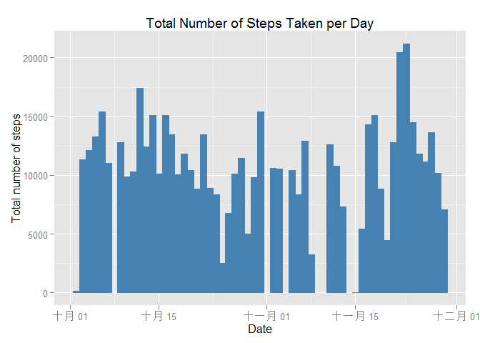
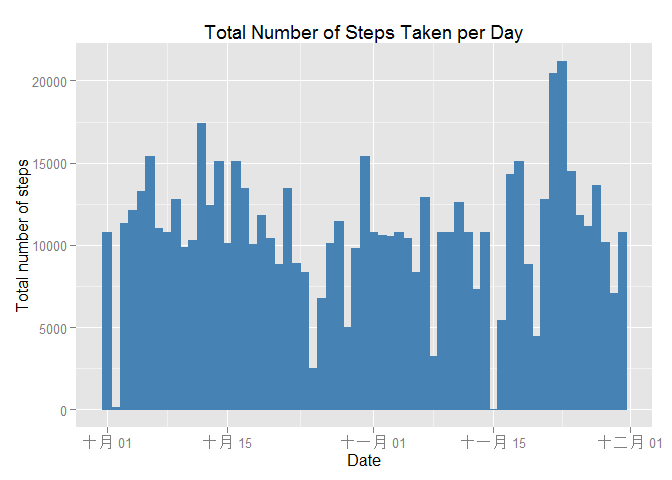

# Reproducible Research: Peer Assessment 1

## Loading and preprocessing the data


```r
echo = TRUE 

unzip("activity.zip")
OriginalData <- read.csv("activity.csv", colClasses = c("integer", "Date", "factor"))
Data_noNA <- na.omit(OriginalData)
rownames(Data_noNA) <- 1:nrow(Data_noNA)
head(Data_noNA)
```

```
##   steps       date interval
## 1     0 2012-10-02        0
## 2     0 2012-10-02        5
## 3     0 2012-10-02       10
## 4     0 2012-10-02       15
## 5     0 2012-10-02       20
## 6     0 2012-10-02       25
```

```r
dim(Data_noNA)
```

```
## [1] 15264     3
```


## What is mean total number of steps taken per day?

```r
library(ggplot2)

ggplot(Data_noNA, aes(date, steps)) + geom_bar(stat = "identity", colour = "steelblue", fill = "steelblue", width = 1) +  labs(title = "Total Number of Steps Taken per Day", x = "Date", y = "Total number of steps")
```

 

```r
TotalSteps <- aggregate(Data_noNA$steps, list(Date = Data_noNA$date), FUN = "sum")$x
mean(TotalSteps)
```

```
## [1] 10766.19
```

```r
median(TotalSteps)
```

```
## [1] 10765
```

## What is the average daily activity pattern?

```r
AverateSteps <- aggregate(Data_noNA$steps, list(interval = as.numeric(as.character(Data_noNA$interval))), FUN = "mean")
names(AverateSteps)[2] <- "MeanSteps"

ggplot(AverateSteps, aes(interval, MeanSteps)) + geom_line(color = "steelblue", size = 1) + labs(title = "Time Series Plot", x = "5-minute intervals", y = "Average Number of Steps Taken")
```

 

*Which 5-minute interval, on average across all the days in the dataset, contains the maximum number of steps?

```r
AverateSteps[AverateSteps$MeanSteps == max(AverateSteps$MeanSteps), ]
```

```
##     interval MeanSteps
## 104      835  206.1698
```

## Imputing missing values
*Calculate and report the total number of missing values in the dataset

```r
sum(is.na(OriginalData))
```

```
## [1] 2304
```

*Use the mean for that 5-minute interval to fill each NA value in the steps column

```r
NewData <- OriginalData 
for (i in 1:nrow(NewData)) {
    if (is.na(NewData$steps[i])) {
        NewData$steps[i] <- AverateSteps[which(NewData$interval[i] == AverateSteps$interval), ]$MeanSteps
    }
}

head(NewData)
```

```
##       steps       date interval
## 1 1.7169811 2012-10-01        0
## 2 0.3396226 2012-10-01        5
## 3 0.1320755 2012-10-01       10
## 4 0.1509434 2012-10-01       15
## 5 0.0754717 2012-10-01       20
## 6 2.0943396 2012-10-01       25
```

```r
ggplot(NewData, aes(date, steps)) + geom_bar(stat = "identity", colour = "steelblue", fill = "steelblue", width = 1) +  labs(title = "Total Number of Steps Taken per Day", x = "Date", y = "Total number of steps")
```

 

*Mean & Medium

```r
NewTotalSteps <- aggregate(NewData$steps, list(Date = NewData$date), FUN = "sum")$x
NewMean <- mean(NewTotalSteps)
NewMean
```

```
## [1] 10766.19
```

```r
NewMedian <- median(NewTotalSteps)
NewMedian
```

```
## [1] 10766.19
```
*Compare them with original data:

```r
OriginalMean <- mean(TotalSteps)
OriginalMedian <- median(TotalSteps)
NewMean - OriginalMean
```

```
## [1] 0
```

```r
NewMedian - OriginalMedian
```

```
## [1] 1.188679
```

```r
NewMean - NewMedian
```

```
## [1] 0
```

*The new mean is the same as the orginal mean
*The new medium is a bit greater than the original medium
*The new mean equals to the new medium


## Are there differences in activity patterns between weekdays and weekends?

* Categorize data set into weekday & weekend (My laptop is supported by Chinese language)

```r
NewData$weekdays <- factor(format(NewData$date, "%A"))
levels(NewData$weekdays)
```

```
## [1] "星期二" "星期六" "星期日" "星期三" "星期四" "星期五" "星期一"
```

```r
levels(NewData$weekdays) <- list(weekday = c("星期一", "星期二", "星期三", "星期四", "星期五"),
                                 weekend = c("星期六", "星期日"))
levels(NewData$weekdays)
```

```
## [1] "weekday" "weekend"
```

```r
table(NewData$weekdays)
```

```
## 
## weekday weekend 
##   12960    4608
```

*Make a panel plot containing a time series plot (i.e. type = "l") of the 5-minute interval (x-axis) and the average number of steps taken, averaged across all weekday days or weekend days (y-axis)


```r
AverageSteps <- aggregate(NewData$steps, list(interval = as.numeric(as.character(NewData$interval)), 
                                              weekdays = NewData$weekdays), FUN = "mean")
names(AverageSteps)[3] <- "meanOfSteps"
library(lattice)
xyplot(AverageSteps$meanOfSteps ~ AverageSteps$interval | AverageSteps$weekdays, 
       layout = c(1, 2), type = "l", xlab = "Interval", ylab = "Number of steps")
```

 

